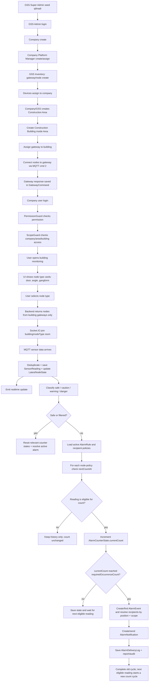

# GSS IoT V3 — Eski loyiha analizi va yangi RBAC architecture blueprint

> Revision: Alarm notification flow `회수` (valid sensor occurrence count) va `지속시간` (count interval) talabiga moslashtirildi. Hujjatning qolgan architecture, RBAC, endpoint, UI, seed, report va edge-case qismlari saqlandi.

## 0. Xulosa

Bu blueprint `gss-iot-rbac-requirements-ai-ready-v2.md`, `parfumbox-rbac-reference.md` va eski `GSS-web-dashboard-V.2.0ZIP.zip` ichidagi backend/frontend kodlari asosida tayyorlandi.

Yangi loyiha uchun asosiy qaror:

- Eski loyiha business flow saqlanadi.
- Eski `admin / manager / worker` hardcoded role modeli RBAC + scope modelga almashtiriladi.
- GSS Admin Portal va Company Dashboard authorization alohida yuritiladi.
- Backend real security layer bo'ladi; frontend permission UX uchun ishlaydi.
- Company user access har doim 2 bosqichdan o'tadi: `permission` + `company/area/building scope`.
- Device assignment, gateway-building assignment, node-gateway connection, MQTT command, alarm level/fault filter hammasi auditable history bilan saqlanadi.
- Offline gateway command uchun `GatewayCommand` outbox mexanizmi qo'shiladi.
- Alarm notification recipientlari platform `role`i bilan emas, company ichidagi `position/lavozim` + company/area/building scope orqali aniqlanadi; platform role esa UI/API permissionlarini boshqarishda davom etadi.
- Alarm triggeri faqat vaqt davomiyligiga emas, `회수` = valid sensor occurrence count va `지속시간` = har bir count orasidagi minimal interval asosida ishlaydi.

---

## 1. Eski loyiha analizi

### 1.1 Repository layout

```txt
GSS-web-dashboard-V.2.0ZIP/
  docs/
  gss-backend-new/       # Node.js / Express / MongoDB / Mongoose backend
  GSS-new-design/        # React / Vite / TypeScript frontend
  task.md
```

### 1.2 Backend stack

```txt
Runtime: Node.js
Framework: Express
DB: MongoDB
ODM: Mongoose
Auth: JWT + httpOnly cookie access_token
Realtime: Socket.IO
IoT: MQTT
Reports: exceljs, json2csv, adm-zip, mustache, puppeteer
Upload: S3 presigned URL + file routes
```

### 1.3 Backend active route mountlari

`src/routes/index.route.js` bo'yicha active API groups:

```txt
/auth       -> modules/auth/auth.routes.js
/users      -> modules/users/user.route.js
/nodes      -> modules/nodes/node.route.js
/gateways   -> modules/gateways/gateway.route.js
/buildings  -> modules/building/building.route.js
/companies  -> modules/company/company.route.js
/weather    -> modules/weather/weather.routes.js
/reports    -> modules/reports/report.route.js
/alerts     -> modules/alertion/alert.route.js
/files      -> routes/file.routes.js
/assets     -> modules/assets/asset.routes.js
/admin      -> modules/admin-dashboard/admin.routes.js
/manager    -> modules/manager-dashboard/dashboard.routes.js
/worker     -> modules/worker-dashboard/dashboard.routes.js
```

### 1.4 Eski backenddagi asosiy domainlar

```txt
Auth
Users
Companies
Company Members
Buildings
Building Workers
Gateways
Nodes
Node histories
Alarm levels
Gateway alarm settings
Alerts
Weather
Reports
Assets
Admin dashboard
Manager dashboard
Worker dashboard
MQTT
Socket.IO
```

### 1.5 Eski DB modellari

#### User

```txt
User
  name
  email
  phone
  password
  userType: admin | manager | worker | user
  isAssigned
```

Muammo: `isActive`, `role`, `permissions`, `company scope`, `area scope`, `building scope` yo'q. `userType` business role va auth role sifatida aralash ishlatilgan.

#### Company

```txt
Company
  companyName
  companyCode
  companyAddress
  companyTel
  companyEmail
  companyLogo
  companyStatus: active | inactive
```

#### CompanyMember

```txt
CompanyMember
  companyId
  memberId -> User
  memberRole: manager | worker
  status: active | inactive
```

Muammo: manager/worker permission emas, faqat hardcoded role. Viewer, site manager, platform manager, custom roles yo'q.

#### Building

```txt
Building
  title
  number
  address
  buildingType
  buildingPlanImage[] max 4
  buildingRealImage[] max 4
  buildingStatus
  startDate
  isAssigned
  companyId
```

Muammo: `ConstructionArea` yo'q. Yangi hierarchy uchun `Company -> Area -> Building` bo'lishi kerak.

#### BuildingWorker

```txt
BuildingWorker
  companyId
  buildingId
  userId
  status
```

Muammo: bu scope jadval sifatida ishlatilgan, lekin RBAC bilan integratsiya qilinmagan.

#### Gateway

```txt
Gateway
  serialNumber
  gatewayType: nodes_gateway | security_office_gateway
  isAssigned
  companyId
  buildingId
  installedLocation
  gatewayStatus: online | offline
  lastSeenAt
```

Muammo: gateway GSS inventorydan kompaniyaga, keyin buildingga assignment tarixi bilan yuritilmaydi. Hozir active state gateway ichida saqlanadi.

#### Node

```txt
Node
  number
  nodeType: door_node | angle_node | gangform_node
  companyId
  buildingId
  gatewayId
  status
  installedLocationTitle
  installedLocation.planImageIndex
  installedLocation.xPercent
  installedLocation.yPercent
  isAssigned
  doorState
  batteryLevel
  angleX
  angleY
  calibratedX
  calibratedY
  saveStatus
  lastSeenAt
```

Muammo: node assignment ham inline. Node-gateway connection history yo'q. `NODE_STATUS` JS syntax xatosi bor: TypeScript unionga o'xshab yozilgan, lekin JS file ichida bu noto'g'ri.

#### Alarm-related old models

```txt
BuildingAlarmLevel
  buildingId
  alarmType: door_node | angle_node | gangform_node
  green
  yellow
  red

GatewayAlarmSetting
  gatewayId
  gatewaySerialNum
  door.alarmEnabled / alarmLevel1..3 / faultFilterNodes
  angle.alarmEnabled / alarmLevel1..3 / faultFilterNodes
  vertical.alarmEnabled / alarmLevel1..3 / faultFilterNodes
  updatedBy

AlertLog
  building
  gateway
  gateway_serial
  node
  doorNum
  level: yellow | red
  metric
  value
  threshold
  raw
```

Muammo: Alarm notification workflow yo'q. `caution / warning / danger` bo'yicha valid sensor occurrence count (`회수`) va count interval (`지속시간`) logic yo'q. Notification recipient position/scope, channel va delivery log yo'q.

### 1.6 Eski loyihadagi 3 node type

Koddan aniqlangan node types:

| Old code key    | MQTT nodeType | UI nomi                      | Sensor payload                                      | Izoh                                                                     |
| --------------- | ------------: | ---------------------------- | --------------------------------------------------- | ------------------------------------------------------------------------ |
| `door_node`     |           `0` | Door / hatch / scaffold node | `doorNum`, `doorChk`, `betChk`, optional `betChk_2` | `doorChk: 0 safe/closed`, `1 danger/open`; `betChk` battery              |
| `angle_node`    |           `1` | Angle node                   | `doorNum`, `angle_x`, `angle_y`                     | angle X/Y, calibration, status safe/caution/warning/danger               |
| `gangform_node` |           `2` | Gangform / vertical node     | `doorNum`, `angle_x`, `angle_y`                     | code ichida `vertical` deb ham yuritilgan; naming normalize qilish kerak |

Yangi loyihada `NodeType` jadvali bo'lishi kerak:

```txt
door_node      displayName: Door Node      numericCode: 0
angle_node     displayName: Angle Node     numericCode: 1
gangform_node  displayName: Gangform Node  numericCode: 2
```

### 1.7 Eski MQTT design

#### Subscribe topics

```txt
BASE = GSSIOT/01030369081
GSSIOT/01030369081/GATE_PUB/+   # door node data
GSSIOT/01030369081/GATE_RES/+   # gateway response
GSSIOT/01030369081/GATE_ANG/+   # angle node data
GSSIOT/01030369081/GATE_FORM/+  # gangform/vertical data
```

#### Publish topic

```txt
GSSIOT/01030369081/GATE_SUB/GRM22JU22P{gatewaySerial}
```

#### Commands

```txt
cmd: 2 -> register/connect nodes to gateway
payload: { cmd: 2, nodeType: 0|1|2, numNodes, nodes: [nodeNumber] }

cmd: 3 -> wake-up/security office gateway
payload: { cmd: 3, alarmActive, alertLevel }

cmd: 4 -> alarm level set
payload door: { cmd: 4, nodeType: 0, alarmEnabled, enabled }
payload angle/gangform: { cmd: 4, nodeType: 1|2, enabled, alarmEnabled, alarmLevel1, alarmLevel2, alarmLevel3 }

cmd: 5 -> fault filter set
payload: { cmd: 5, nodeType: 0|1|2, numNodes, nodes: [nodeNumber] }
```

### 1.8 Eski frontend active pages

#### Admin

```txt
/admin/dashboard
/admin/companies/:companyId/buildings
/admin/companies/:companyId/buildings/:buildingId/devices
/admin/devices
/admin/organizations
/admin/buildings/:buildingId
/admin/buildings/:buildingId/vertical-nodes
/admin/buildings/:buildingId/gangform-nodes
/admin/buildings/:buildingId/angle-nodes
/admin/company/assigning
```

#### Manager

```txt
/manager/dashboard
/manager/buildings
/manager/devices
/manager/organizations
/manager/buildings/:buildingId/gangform-nodes
/manager/buildings/:buildingId/scaffold-nodes
/manager/buildings/:buildingId/angle-nodes
```

#### Worker

```txt
/worker/dashboard/buildings
/worker/buildings/:buildingId/gangform-nodes
/worker/buildings/:buildingId/scaffold-nodes
/worker/buildings/:buildingId/angle-nodes
```

### 1.9 Eski loyiha muammolari

1. **RBAC yo'q**: `Permission`, `RolePermission`, direct permission model yo'q. `src/shared/constants/roles.js` va `permissions.js` bo'sh.
2. **Hardcoded userType**: frontend `ProtectedRoute allowedRoles`, backend `isAdmin/isManager/isWorker` ishlatadi.
3. **Backend auth inconsistent**: `/nodes`, `/gateways`, `/manager`, `/worker`, `/users` qisman protected; lekin `/admin`, `/companies`, `/buildings`, `/weather`, `/reports`, `/alerts`, `/assets`, `/files` route grouplarida route-level auth ko'rinmaydi.
4. **Admin endpoints xavfli**: `/admin/*` ichida `router.use(isAuth, isAdmin)` yo'q.
5. **Role field mismatch**: ba'zi middleware `req.user.user_type`, ba'zilari `req.user.userType` ishlatadi.
6. **Frontend redirect mismatch**: `getDefaultRouteByRole` uppercase `ADMIN/MANAGER/WORKER` kutadi, real store lowercase `admin/manager/worker`; manager path `/client/dashboard` deb yozilgan, active path `/manager/dashboard`.
7. **ConstructionArea yo'q**: yangi hierarchy uchun eng katta structural gap.
8. **Assignment history yo'q**: gateway-company, gateway-building, node-gateway tarixsiz inline state.
9. **MQTT command outbox yo'q**: offline gateway uchun pending command saqlash to'liq yo'q.
10. **Alarm notification yo'q**: faqat level/fault filter bor, delay + recipient + delivery log yo'q.
11. **Reports bor, lekin permission/export separation yo'q**.
12. **Alert route order bug**: `/alerts/:id` static `/stats/summary`, `/recent/list`, `/export/csv` dan oldin turibdi.
13. **Mixed old/new code**: `src/routes`, `src/services`, `src/modules` parallel mavjud; unmounted legacy route/service fayllar bor.
14. **Naming inconsistent**: `serial_number` vs `serialNumber`, `node_number` vs `number`, `angle_x` vs `angleX`, `gangform` vs `vertical`.
15. **Scope bug risk**: worker building access ba'zi joyda faqat company membership orqali tekshiriladi, har doim building assignment bilan tekshirilmaydi.
16. **Hardcoded MQTT credential/topic base**: environment configga chiqarish kerak.
17. **No audit log**: critical changes audit qilinmaydi.
18. **No inactive-token enforcement**: user active/inactive status aniq auth layerga ulanmagan.

---

## 2. Yangi target architecture

### 2.1 Tavsiya qilingan stack

```txt
Backend: NestJS + TypeScript
DB: PostgreSQL + Prisma
Realtime: Socket.IO Gateway
MQTT: MQTT client service + GatewayCommand outbox
Jobs: BullMQ + Redis yoki Nest scheduler (notification delivery retry, reports; occurrence count esa sensor reading kelganda DB transaction ichida hisoblanadi)
Storage: S3 compatible storage
Frontend: React/Vite/TypeScript + TanStack Query + Zustand
```

Agar MongoDBda qolish majburiy bo'lsa ham RBAC modelni Mongoose bilan qilish mumkin, lekin relational RBAC, scope, assignment history va reports uchun PostgreSQL/Prisma tozaroq.

### 2.2 Backend folder architecture

```txt
apps/api/src/
  main.ts
  app.module.ts

  common/
    decorators/
      admin-endpoint.decorator.ts
      company-endpoint.decorator.ts
      require-permissions.decorator.ts
      require-company-scope.decorator.ts
      require-area-scope.decorator.ts
      require-building-scope.decorator.ts
    guards/
      jwt-auth.guard.ts
      active-user.guard.ts
      permissions.guard.ts
      company-scope.guard.ts
      area-scope.guard.ts
      building-scope.guard.ts
    interceptors/
      audit-log.interceptor.ts
    filters/
      http-exception.filter.ts
    constants/
      permissions.ts
      node-types.ts
      command-status.ts

  modules/
    auth/
      gss-admin-auth.controller.ts
      company-auth.controller.ts
      auth.service.ts
      jwt.strategy.ts

    rbac/
      permissions.controller.ts
      gss-roles.controller.ts
      company-roles.controller.ts
      rbac.service.ts
      permission-resolver.service.ts

    gss-admin-users/
    company-users/
    company-positions/
    companies/
    construction-areas/
    construction-buildings/
    building-plans/

    devices/
      devices.controller.ts
      gateways.controller.ts
      nodes.controller.ts
      device-assignment.service.ts

    gateway-commands/
      gateway-commands.controller.ts
      gateway-command-outbox.service.ts
      gateway-command-publisher.service.ts

    mqtt/
      mqtt.module.ts
      mqtt.service.ts
      mqtt-topic.service.ts
      mqtt-payload-parser.service.ts
      mqtt-response-handler.service.ts

    monitoring/
      monitoring.controller.ts
      monitoring-gateway.ts
      sensor-readings.service.ts
      latest-node-state.service.ts

    alarm-levels/
    alarm-rules/
      alarm-rules.controller.ts
      alarm-rules.service.ts
      alarm-recipient-policy.service.ts
    alarms/
      alarm-evaluator.service.ts
      alarm-counter-state.service.ts
      alarm-events.service.ts
      alarm-reset.service.ts
    notifications/
      notification-orchestrator.service.ts
      notification-recipient-resolver.service.ts
      notification-delivery.processor.ts

    reports/
    audit-logs/
    settings/
```

### 2.3 Frontend folder architecture

```txt
apps/web/src/
  app/
    router.tsx
    providers/
      AuthProvider.tsx
      QueryProvider.tsx

  shared/
    api/httpClient.ts
    auth/useCurrentUser.ts
    rbac/
      permissions.ts
      hasPermission.ts
      RequireAuth.tsx
      RequirePermission.tsx
      Can.tsx
      SidebarGuard.tsx
    scope/
      useCurrentCompanyScope.ts
    ui/

  features/
    gss-admin/
      pages/
        WelcomePage.tsx
        DashboardPage.tsx
        CompaniesPage.tsx
        CompanyDetailPage.tsx
        DevicesPage.tsx
        GatewaysPage.tsx
        NodesPage.tsx
        DeviceAssignmentsPage.tsx
        MqttCommandsPage.tsx
        MonitoringPage.tsx
        AlarmsPage.tsx
        AlarmRulesPage.tsx
        ReportsPage.tsx
        AuditLogsPage.tsx
        SettingsAdminUsersPage.tsx
        SettingsRolesPage.tsx
        SettingsPermissionsPage.tsx
      routes.tsx
      sidebar.ts

    company-dashboard/
      pages/
        WelcomePage.tsx
        DashboardPage.tsx
        AreasPage.tsx
        AreaDetailPage.tsx
        BuildingsPage.tsx
        BuildingDetailPage.tsx
        BuildingPlanPage.tsx
        BuildingMonitoringPage.tsx
        BuildingNodeTypeMonitoringPage.tsx
        BuildingAlarmLevelsPage.tsx
        AlarmsPage.tsx
        ReportsPage.tsx
        UsersPage.tsx
        RolesPage.tsx
        SettingsPage.tsx
      routes.tsx
      sidebar.ts
```

---

## 3. Full project flow chart



Alarm subsystemning asosiy ajratilishi:

```txt
Platform role -> user platformda nima qila oladi
Company position/lavozim -> alarm recipient kategoriyasi
Scope -> qaysi company/area/building alarmi userga tegishli
Alarm policy -> severity + requiredOccurrenceCount + countIntervalSeconds + channel
```

---

## 4. Permission naming convention

Pattern:

```txt
module.action
```

Actions:

```txt
view, create, update, delete, manage, assign, configure, acknowledge, resolve, export
```

### 4.1 Final permission catalog

#### Common

```txt
welcome.view
dashboard.view
```

#### GSS Admin permissions

```txt
companies.view
companies.create
companies.update
companies.delete
companies.manage

areas.view
areas.create
areas.update
areas.delete
areas.manage

buildings.view
buildings.create
buildings.update
buildings.delete
buildings.manage
building-plans.view
building-plans.manage

company-users.view
company-users.create
company-users.update
company-users.delete
company-users.manage
# company position catalog va user-position assignment ham shu module permissionlari bilan boshqariladi

company-roles.view
company-roles.manage
company-permissions.view

admin-users.view
admin-users.create
admin-users.update
admin-users.delete
admin-users.manage

admin-roles.view
admin-roles.manage
permissions.view
permissions.manage

devices.view
devices.create
devices.update
devices.delete
devices.manage
devices.assign

gateways.view
gateways.create
gateways.update
gateways.delete
gateways.assign
gateways.commands

nodes.view
nodes.create
nodes.update
nodes.delete
nodes.assign
nodes.configure

device-assignments.view
device-assignments.manage
mqtt-commands.view
mqtt-commands.manage

monitoring.view
monitoring.realtime
monitoring.admin-overview

alarm-levels.view
alarm-levels.manage
alarm-rules.view
alarm-rules.manage
alarms.view
alarms.manage
alarms.acknowledge
alarms.resolve
notifications.view
notifications.manage

reports.view
reports.export
reports.company
reports.devices
reports.monitoring
reports.alarms
reports.audit

audit-logs.view
audit-logs.export
settings.system.view
settings.system.manage
```

#### Company Dashboard permissions

```txt
company-profile.view
company-profile.update

areas.view
areas.create
areas.update
areas.delete
areas.manage

buildings.view
buildings.create
buildings.update
buildings.delete
buildings.manage
building-plans.view
building-plans.manage

company-devices.view
gateways.view
nodes.view
gateway-node-connections.view
gateway-node-connections.update

monitoring.view
monitoring.realtime

alarm-levels.view
alarm-levels.manage
alarm-rules.view
alarm-rules.manage
alarms.view
alarms.acknowledge
alarms.resolve
notifications.view
notifications.manage

reports.view
reports.export
reports.monitoring
reports.alarms

company-users.view
company-users.create
company-users.update
company-users.delete
company-users.manage

company-roles.view
company-roles.manage
company-permissions.view

settings.company.view
settings.company.manage
```

---

## 5. Default roles

### 5.1 GSS Admin roles

| Role key             | Purpose                    | Rule                                                               |
| -------------------- | -------------------------- | ------------------------------------------------------------------ |
| `gss_super_admin`    | Full platform owner        | `isSuperAdmin=true`; permission rows bo'lmasa ham pass             |
| `gss_admin`          | Operational admin          | Company, building, device assignment, monitoring, alarms, reports  |
| `gss_device_manager` | Hardware/device operations | Gateways, nodes, assignments, MQTT commands                        |
| `gss_support`        | Support/read-only          | View company/device/monitoring/alarms/logs; no delete/manage roles |
| `gss_report_manager` | Reporting                  | Reports view/export, audit/report history                          |

### 5.2 Company roles

| Role key           | Purpose                        | Scope                    |
| ------------------ | ------------------------------ | ------------------------ |
| `platform_manager` | Company ichidagi full manager  | Entire company           |
| `area_manager`     | Construction area/site manager | Assigned areas           |
| `building_manager` | Building operator/manager      | Assigned buildings       |
| `viewer`           | Read-only viewer               | Assigned areas/buildings |
| `no_permission`    | Login only / testing           | No protected permission  |

---

## 6. Role-permission matrix

Legend:

```txt
F = full/manage
V = view only
A = assign/configure
E = export
- = no access
```

### 6.1 GSS Admin matrix

| Module                 | super_admin | gss_admin | device_manager | support | report_manager |
| ---------------------- | ----------: | --------: | -------------: | ------: | -------------: |
| Dashboard              |           F |         V |              V |       V |              V |
| Companies              |           F |         F |              V |       V |              V |
| Areas/Buildings        |           F |         F |              V |       V |              V |
| Company Users          |           F |         F |              - |       V |              - |
| Company Positions      |           F |         F |              - |       V |              - |
| GSS Admin Users        |           F |         - |              - |       - |              - |
| GSS Roles/Permissions  |           F |         - |              - |       - |              - |
| Devices/Gateways/Nodes |           F |         A |              F |       V |              V |
| Device Assignments     |           F |         A |              F |       V |              V |
| Gateway Commands/MQTT  |           F |         A |              F |       V |              V |
| Monitoring             |           F |         V |              V |       V |              V |
| Alarm Levels           |           F |         F |              A |       V |              V |
| Alarm Rules            |           F |         F |              - |       V |              V |
| Alarms                 |           F |         F |              V |       V |              V |
| Notifications          |           F |         F |              - |       V |              - |
| Reports                |           F |         E |              V |       V |            F/E |
| Audit Logs             |           F |         V |              V |       V |              E |
| System Settings        |           F |         - |              - |       - |              - |

### 6.2 Company matrix

| Module                    | platform_manager |               area_manager |   building_manager |   viewer | no_permission |
| ------------------------- | ---------------: | -------------------------: | -----------------: | -------: | ------------: |
| Welcome                   |                V |                          V |                  V |        V |             V |
| Dashboard                 |                F |                          V |                  V |        V |             - |
| Company profile           |                F |                          V |                  V |        V |             - |
| Areas                     |                F |                   F scoped |           V scoped | V scoped |             - |
| Buildings                 |                F |                   F scoped |           V scoped | V scoped |             - |
| Building plans            |                F |                   F scoped |           V scoped | V scoped |             - |
| Assigned devices          |                V |                   V scoped |           V scoped | V scoped |             - |
| Monitoring                |                F |                   V scoped |           V scoped | V scoped |             - |
| Alarm levels              |                F |                   A scoped |         A/V scoped | V scoped |             - |
| Alarm rules               |                F |                   A scoped |           V scoped | V scoped |             - |
| Alarms                    |                F |         acknowledge scoped | acknowledge scoped | V scoped |             - |
| Notifications             |                F |                   V scoped |           V scoped |        - |             - |
| Reports                   |              F/E |                 V/E scoped |           V scoped | V scoped |             - |
| Company users             |                F | scoped V/manage if allowed |                  - |        - |             - |
| Company positions         |                F |                   V scoped |           V scoped |        - |             - |
| Company roles/permissions |                F |                          - |                  - |        - |             - |
| Settings                  |                F |                          - |                  - |        - |             - |

---

## 7. New DB schema / diagram

### 7.1 Mermaid ER diagram

```mermaid
erDiagram
  Company ||--o{ ConstructionArea : has
  ConstructionArea ||--o{ ConstructionBuilding : has
  ConstructionBuilding ||--o{ BuildingPlanImage : has

  GssAdminUser }o--|| GssRole : role
  GssRole ||--o{ GssRolePermission : has
  Permission ||--o{ GssRolePermission : included
  GssAdminUser ||--o{ GssAdminUserPermission : direct
  Permission ||--o{ GssAdminUserPermission : direct

  Company ||--o{ CompanyUser : has
  CompanyUser }o--|| CompanyRole : role
  CompanyRole ||--o{ CompanyRolePermission : has
  Permission ||--o{ CompanyRolePermission : included
  CompanyUser ||--o{ CompanyUserPermission : direct
  Permission ||--o{ CompanyUserPermission : direct
  CompanyUser ||--o{ CompanyUserAreaAccess : scope
  CompanyUser ||--o{ CompanyUserBuildingAccess : scope
  ConstructionArea ||--o{ CompanyUserAreaAccess : scope
  ConstructionBuilding ||--o{ CompanyUserBuildingAccess : scope
  Company ||--o{ CompanyPosition : defines
  CompanyUser ||--o{ CompanyUserPositionAssignment : has_position
  CompanyPosition ||--o{ CompanyUserPositionAssignment : assigned
  ConstructionArea ||--o{ CompanyUserPositionAssignment : position_scope
  ConstructionBuilding ||--o{ CompanyUserPositionAssignment : position_scope

  NodeType ||--o{ Node : classifies
  Company ||--o{ CompanyDeviceAssignment : owns_or_rents
  Gateway ||--o{ CompanyDeviceAssignment : assigned
  Node ||--o{ CompanyDeviceAssignment : assigned
  ConstructionBuilding ||--o{ GatewayBuildingAssignment : has
  Gateway ||--o{ GatewayBuildingAssignment : placed
  Gateway ||--o{ NodeGatewayAssignment : connects
  Node ||--o{ NodeGatewayAssignment : connected

  Gateway ||--o{ GatewayCommand : receives
  Gateway ||--o{ MqttMessageLog : logs
  Node ||--o{ SensorReading : readings
  Node ||--|| LatestNodeState : latest

  ConstructionBuilding ||--o{ AlarmRule : rules
  Gateway ||--o{ AlarmLevel : levels
  NodeType ||--o{ AlarmLevel : levels
  AlarmRule ||--o{ AlarmRecipientPolicy : has
  CompanyPosition ||--o{ AlarmRecipientPolicy : targets
  AlarmRecipientPolicy ||--o{ AlarmCounterState : counts
  Node ||--o{ AlarmCounterState : state_per_node_policy
  AlarmRule ||--o{ AlarmEvent : creates
  AlarmEvent ||--o{ AlarmNotification : sends
  AlarmRecipientPolicy ||--o{ AlarmNotification : triggered_by
  AlarmNotification ||--o{ AlarmDeliveryLog : delivery

  ReportJob ||--o{ ReportExport : exports
  GssAdminUser ||--o{ AuditLog : actor
  CompanyUser ||--o{ AuditLog : actor
```



### 7.2 Table design

#### Organization

```txt
companies
  id uuid pk
  name
  code unique nullable
  address
  phone
  email
  logoKey nullable
  status active|inactive
  createdAt updatedAt deletedAt

construction_areas
  id uuid pk
  companyId fk companies
  name
  address nullable
  description nullable
  status active|inactive
  createdAt updatedAt deletedAt

construction_buildings
  id uuid pk
  companyId fk companies
  areaId fk construction_areas
  title
  number nullable
  address
  buildingType
  status active|inactive
  startDate nullable
  createdAt updatedAt deletedAt

building_plan_images
  id uuid pk
  buildingId fk construction_buildings
  kind plan|real
  storageKey
  orderIndex
  width nullable
  height nullable
  createdAt
```

#### RBAC

```txt
permissions
  id uuid pk
  key unique
  module
  action
  scopeType gss|company|both
  description

 gss_roles
  id uuid pk
  key unique
  name
  isSuperAdmin boolean
  isSystem boolean
  createdAt updatedAt

 gss_admin_users
  id uuid pk
  roleId fk gss_roles
  name email passwordHash phone
  isActive boolean
  lastLoginAt
  createdAt updatedAt

 gss_role_permissions
  roleId fk gss_roles
  permissionId fk permissions
  unique(roleId, permissionId)

 gss_admin_user_permissions
  adminUserId fk gss_admin_users
  permissionId fk permissions
  effect allow|deny default allow
  unique(adminUserId, permissionId)

 company_roles
  id uuid pk
  companyId fk companies nullable for template roles
  key
  name
  isSystem boolean
  isCompanyOwnerRole boolean default false
  createdAt updatedAt
  unique(companyId, key)

 company_users
  id uuid pk
  companyId fk companies
  roleId fk company_roles
  name email passwordHash phone
  isActive boolean
  lastLoginAt
  createdAt updatedAt

 company_role_permissions
  roleId fk company_roles
  permissionId fk permissions
  unique(roleId, permissionId)

 company_user_permissions
  companyUserId fk company_users
  permissionId fk permissions
  effect allow|deny default allow
  unique(companyUserId, permissionId)

 company_user_area_access
  companyUserId fk company_users
  areaId fk construction_areas
  accessLevel view|manage
  unique(companyUserId, areaId)

 company_user_building_access
  companyUserId fk company_users
  buildingId fk construction_buildings
  accessLevel view|manage
  unique(companyUserId, buildingId)

 company_positions
  id uuid pk
  companyId fk companies
  key
  name                  # 현장담당자, 현장반장, 사무실관리자, 공무, 현장소장, 프로젝트PM, ...
  isActive boolean
  createdAt updatedAt
  unique(companyId, key)

 company_user_position_assignments
  id uuid pk
  companyUserId fk company_users
  positionId fk company_positions
  areaId fk construction_areas nullable
  buildingId fk construction_buildings nullable
  status active|ended
  assignedAt
  endedAt nullable
  unique(companyUserId, positionId, areaId, buildingId) where status='active'
```

#### Devices

```txt
node_types
  id uuid pk
  key unique          # door_node | angle_node | gangform_node
  numericCode int     # 0 | 1 | 2
  displayName
  valueSchema jsonb
  isActive boolean

gateways
  id uuid pk
  serialNumber unique
  gatewayType nodes_gateway|security_office_gateway
  inventoryStatus available|assigned|maintenance|retired
  onlineStatus online|offline
  lastSeenAt nullable
  createdAt updatedAt deletedAt

nodes
  id uuid pk
  number int unique
  nodeTypeId fk node_types
  inventoryStatus available|assigned|maintenance|retired
  latestStatus safe|caution|warning|danger|offline
  lastSeenAt nullable
  createdAt updatedAt deletedAt

company_device_assignments
  id uuid pk
  companyId fk companies
  deviceType gateway|node
  gatewayId fk gateways nullable
  nodeId fk nodes nullable
  status active|ended
  assignedAt
  endedAt nullable
  assignedByAdminId nullable
  note nullable

gateway_building_assignments
  id uuid pk
  gatewayId fk gateways
  companyId fk companies
  buildingId fk construction_buildings
  status active|ended
  assignedAt
  endedAt nullable
  assignedByAdminId nullable
  unique(gatewayId) where status='active'

node_gateway_assignments
  id uuid pk
  nodeId fk nodes
  gatewayId fk gateways
  companyId fk companies
  buildingId fk construction_buildings
  status active|ended
  assignedAt
  endedAt nullable
  commandId fk gateway_commands nullable
  unique(nodeId) where status='active'

gateway_commands
  id uuid pk
  gatewayId fk gateways
  commandType register_nodes|set_alarm_level|set_fault_filter|wake_up|sync
  mqttCmd int
  topic
  payload jsonb
  status pending|sent|acknowledged|failed|expired|cancelled
  responsePayload jsonb nullable
  requestedByType gss_admin|company_user|system
  requestedById uuid nullable
  createdAt sentAt acknowledgedAt expiresAt

mqtt_message_logs
  id uuid pk
  direction inbound|outbound
  gatewayId fk gateways nullable
  topic
  payload jsonb
  receivedAt
```

#### Monitoring

```txt
sensor_readings
  id bigserial pk
  companyId fk companies
  areaId fk construction_areas
  buildingId fk construction_buildings
  gatewayId fk gateways
  nodeId fk nodes
  nodeTypeKey
  nodeNumber
  values jsonb
  status safe|caution|warning|danger|offline
  messageId nullable          # gateway message id yoki sequence number
  sequenceNumber nullable
  measuredAt timestamp nullable
  receivedAt timestamp
  unique(gatewayId, nodeId, sequenceNumber) where sequenceNumber is not null

latest_node_states
  nodeId pk fk nodes
  gatewayId fk gateways
  buildingId fk construction_buildings
  values jsonb
  status
  lastSeenAt
  updatedAt
```

#### Alarms / Notifications

```txt
alarm_levels
  id uuid pk
  companyId fk companies
  buildingId fk construction_buildings
  gatewayId fk gateways nullable
  nodeTypeId fk node_types
  alarmEnabled boolean
  cautionThreshold numeric nullable
  warningThreshold numeric nullable
  dangerThreshold numeric nullable
  updatedByType gss_admin|company_user
  updatedById uuid
  updatedAt

fault_filter_nodes
  id uuid pk
  gatewayId fk gateways
  nodeTypeId fk node_types
  nodeNumber int
  isActive boolean
  updatedByType
  updatedById
  updatedAt
  unique(gatewayId, nodeTypeId, nodeNumber)

alarm_rules
  id uuid pk
  companyId fk companies
  areaId fk construction_areas nullable
  buildingId fk construction_buildings nullable
  gatewayId fk gateways nullable
  nodeTypeId fk node_types nullable
  severity caution|warning|danger
  channelDefaults jsonb nullable
  isActive boolean
  createdAt updatedAt

alarm_recipient_policies
  id uuid pk
  ruleId fk alarm_rules
  positionId fk company_positions nullable
  specificUserId fk company_users nullable
  requiredOccurrenceCount int        # 회수
  countIntervalSeconds int           # 지속시간; countlar orasidagi minimal interval
  channel in_app|telegram|sms|email
  isActive boolean
  createdAt updatedAt
  check(requiredOccurrenceCount >= 1)
  check(countIntervalSeconds >= 0)

alarm_counter_states
  id uuid pk
  policyId fk alarm_recipient_policies
  nodeId fk nodes
  severity caution|warning|danger
  currentCount int default 0
  cycleNo int default 1
  cycleStartedAt nullable
  firstCountedReadingId fk sensor_readings nullable
  lastCountedReadingId fk sensor_readings nullable
  lastCountedAt nullable
  nextCountAt nullable
  latestValue jsonb nullable
  status idle|counting
  version int default 0
  updatedAt
  unique(policyId, nodeId)

alarm_events
  id uuid pk
  ruleId fk alarm_rules
  companyId areaId buildingId gatewayId nodeId
  severity caution|warning|danger
  status open|acknowledged|resolved|ignored
  metric
  value numeric nullable
  threshold numeric nullable
  evidence jsonb nullable            # count, interval, first/last reading ids, values snapshot
  openedAt
  lastTriggeredAt nullable
  acknowledgedAt nullable
  resolvedAt nullable
  acknowledgedById nullable
  resolvedById nullable

alarm_notifications
  id uuid pk
  alarmEventId fk alarm_events
  policyId fk alarm_recipient_policies
  recipientUserId fk company_users nullable
  triggerReadingId fk sensor_readings nullable
  triggerCycleNo int
  triggerOccurrenceCount int
  channel
  status pending|sent|failed|cancelled|skipped
  createdAt
  sentAt nullable
  unique(policyId, recipientUserId, triggerReadingId, channel)

alarm_delivery_logs
  id uuid pk
  notificationId fk alarm_notifications
  provider
  request jsonb
  response jsonb
  status
  createdAt
```

Storage qoidasi:

```txt
sensor_readings        -> har unique sensor value uchun INSERT; asosiy katta history table
latest_node_states     -> har node uchun bitta row, doim UPDATE/UPSERT
alarm_counter_states   -> har node + recipient policy uchun bitta kichik row, doim UPDATE
alarm_events           -> policy count sharti real trigger bo'lganda INSERT yoki active event update
alarm_notifications    -> real recipient/channel yuborilishi uchun INSERT
```

`alarm_counter_states` har bir reading uchun yangi row yaratmaydi. Shu sabab count hisoblash uchun alohida yangi database kerak emas va counter data hajmi sensor historyga nisbatan juda kichik qoladi.

#### Reports / Audit

```txt
report_jobs
  id uuid pk
  requestedByType gss_admin|company_user
  requestedById uuid
  companyId nullable
  reportType company|area|building|device|sensor|alarm|mqtt|audit|user_activity
  filters jsonb
  status pending|processing|completed|failed
  createdAt completedAt

report_exports
  id uuid pk
  reportJobId fk report_jobs
  fileKey
  fileType csv|xlsx|pdf|hwpx
  downloadedAt nullable

 audit_logs
  id uuid pk
  actorType gss_admin|company_user|system
  actorId uuid nullable
  action
  entityType
  entityId uuid nullable
  oldValue jsonb nullable
  newValue jsonb nullable
  ipAddress nullable
  userAgent nullable
  createdAt
```

---

## 8. Backend guard/decorator architecture

### 8.1 Admin endpoint

```ts
@AdminEndpoint()
@RequirePermissions('companies.view')
@Get('/admin/companies')
findCompanies() {}
```

`@AdminEndpoint()` ichida:

```txt
JwtAuthGuard
ActiveUserGuard
AdminContextGuard
PermissionsGuard
```

### 8.2 Company endpoint

```ts
@CompanyEndpoint()
@RequirePermissions('monitoring.view')
@RequireBuildingScope('buildingId')
@Get('/company/buildings/:buildingId/monitoring')
getBuildingMonitoring() {}
```

`@CompanyEndpoint()` ichida:

```txt
JwtAuthGuard
ActiveUserGuard
CompanyContextGuard
PermissionsGuard
BuildingScopeGuard
```

### 8.3 Permission resolver

Effective permissions:

```txt
role permissions
+ direct user allow permissions
- direct user deny permissions
```

Super admin:

```txt
if user.role.isSuperAdmin === true -> allow all
```

### 8.4 Scope guard rules

```txt
Company user request:
1. user.companyId === resource.companyId
2. has required permission
3. if area endpoint: user has area access OR platform_manager
4. if building endpoint: user has building access OR area access to parent area OR platform_manager
```

---

## 9. Endpoint-permission matrix

### 9.1 Auth

| Method | Endpoint              | Permission                        | Scope   |
| ------ | --------------------- | --------------------------------- | ------- |
| POST   | `/auth/gss/login`     | public                            | -       |
| GET    | `/auth/gss/me`        | authenticated active admin        | -       |
| POST   | `/auth/company/login` | public                            | -       |
| GET    | `/auth/company/me`    | authenticated active company user | company |
| GET    | `/auth/csrf`          | public CSRF bootstrap             | -       |
| POST   | `/auth/refresh`       | valid rotating refresh session    | context |
| POST   | `/auth/logout`        | authenticated                     | -       |

### 9.2 GSS Admin endpoints

| Method | Endpoint                                        | Permission                  |
| ------ | ----------------------------------------------- | --------------------------- |
| GET    | `/admin/dashboard`                              | `dashboard.view`            |
| GET    | `/admin/companies`                              | `companies.view`            |
| POST   | `/admin/companies`                              | `companies.create`          |
| GET    | `/admin/companies/:companyId`                   | `companies.view`            |
| PATCH  | `/admin/companies/:companyId`                   | `companies.update`          |
| DELETE | `/admin/companies/:companyId`                   | `companies.delete`          |
| GET    | `/admin/companies/:companyId/areas`             | `areas.view`                |
| POST   | `/admin/companies/:companyId/areas`             | `areas.create`              |
| PATCH  | `/admin/areas/:areaId`                          | `areas.update`              |
| DELETE | `/admin/areas/:areaId`                          | `areas.delete`              |
| GET    | `/admin/companies/:companyId/buildings`         | `buildings.view`            |
| POST   | `/admin/areas/:areaId/buildings`                | `buildings.create`          |
| PATCH  | `/admin/buildings/:buildingId`                  | `buildings.update`          |
| DELETE | `/admin/buildings/:buildingId`                  | `buildings.delete`          |
| POST   | `/admin/buildings/:buildingId/plan-images`      | `building-plans.manage`     |
| DELETE | `/admin/building-plan-images/:imageId`          | `building-plans.manage`     |
| GET    | `/admin/company-users`                          | `company-users.view`        |
| POST   | `/admin/companies/:companyId/users`             | `company-users.create`      |
| PATCH  | `/admin/company-users/:userId`                  | `company-users.update`      |
| DELETE | `/admin/company-users/:userId`                  | `company-users.delete`      |
| GET    | `/admin/companies/:companyId/positions`         | `company-users.view`        |
| POST   | `/admin/companies/:companyId/positions`         | `company-users.manage`      |
| PATCH  | `/admin/company-users/:userId/positions`        | `company-users.manage`      |
| GET    | `/admin/gss-users`                              | `admin-users.view`          |
| POST   | `/admin/gss-users`                              | `admin-users.create`        |
| PATCH  | `/admin/gss-users/:id`                          | `admin-users.update`        |
| DELETE | `/admin/gss-users/:id`                          | `admin-users.delete`        |
| GET    | `/admin/roles`                                  | `admin-roles.view`          |
| POST   | `/admin/roles`                                  | `admin-roles.manage`        |
| PATCH  | `/admin/roles/:roleId/permissions`              | `admin-roles.manage`        |
| GET    | `/admin/permissions`                            | `permissions.view`          |
| GET    | `/admin/gateways`                               | `gateways.view`             |
| POST   | `/admin/gateways`                               | `gateways.create`           |
| PATCH  | `/admin/gateways/:gatewayId`                    | `gateways.update`           |
| DELETE | `/admin/gateways/:gatewayId`                    | `gateways.delete`           |
| GET    | `/admin/nodes`                                  | `nodes.view`                |
| POST   | `/admin/nodes`                                  | `nodes.create`              |
| PATCH  | `/admin/nodes/:nodeId`                          | `nodes.update`              |
| DELETE | `/admin/nodes/:nodeId`                          | `nodes.delete`              |
| POST   | `/admin/companies/:companyId/devices/assign`    | `devices.assign`            |
| POST   | `/admin/buildings/:buildingId/gateways/assign`  | `gateways.assign`           |
| POST   | `/admin/gateways/:gatewayId/nodes/connect`      | `nodes.assign`              |
| GET    | `/admin/gateway-commands`                       | `mqtt-commands.view`        |
| POST   | `/admin/gateway-commands/:id/retry`             | `mqtt-commands.manage`      |
| GET    | `/admin/monitoring`                             | `monitoring.admin-overview` |
| PATCH  | `/admin/buildings/:buildingId/alarm-levels`     | `alarm-levels.manage`       |
| PATCH  | `/admin/gateways/:gatewayId/fault-filter`       | `nodes.configure`           |
| GET    | `/admin/alarms`                                 | `alarms.view`               |
| PATCH  | `/admin/alarms/:alarmId/acknowledge`            | `alarms.acknowledge`        |
| PATCH  | `/admin/alarms/:alarmId/resolve`                | `alarms.resolve`            |
| GET    | `/admin/alarm-rules`                            | `alarm-rules.view`          |
| POST   | `/admin/alarm-rules`                            | `alarm-rules.manage`        |
| PATCH  | `/admin/alarm-rules/:ruleId/recipient-policies` | `alarm-rules.manage`        |
| GET    | `/admin/reports`                                | `reports.view`              |
| POST   | `/admin/reports/export`                         | `reports.export`            |
| GET    | `/admin/audit-logs`                             | `audit-logs.view`           |
| POST   | `/admin/audit-logs/export`                      | `audit-logs.export`         |

### 9.3 Company Dashboard endpoints

| Method | Endpoint                                              | Permission               | Scope                 |
| ------ | ----------------------------------------------------- | ------------------------ | --------------------- |
| GET    | `/company/dashboard`                                  | `dashboard.view`         | company               |
| GET    | `/company/profile`                                    | `company-profile.view`   | company               |
| PATCH  | `/company/profile`                                    | `company-profile.update` | company               |
| GET    | `/company/areas`                                      | `areas.view`             | company/area filtered |
| POST   | `/company/areas`                                      | `areas.create`           | company               |
| GET    | `/company/areas/:areaId`                              | `areas.view`             | area                  |
| GET    | `/company/areas/:areaId/overview`                     | `areas.view`             | area                  |
| PATCH  | `/company/areas/:areaId`                              | `areas.update`           | area manage           |
| DELETE | `/company/areas/:areaId`                              | `areas.delete`           | area manage           |
| GET    | `/company/buildings`                                  | `buildings.view`         | scoped buildings      |
| POST   | `/company/areas/:areaId/buildings`                    | `buildings.create`       | area manage           |
| GET    | `/company/buildings/:buildingId`                      | `buildings.view`         | building              |
| GET    | `/company/buildings/:buildingId/overview`             | `buildings.view`         | building              |
| PATCH  | `/company/buildings/:buildingId`                      | `buildings.update`       | building manage       |
| DELETE | `/company/buildings/:buildingId`                      | `buildings.delete`       | building manage       |
| GET    | `/company/buildings/:buildingId/plan`                 | `building-plans.view`    | building              |
| POST   | `/company/buildings/:buildingId/plan-images`          | `building-plans.manage`  | building manage       |
| GET    | `/company/devices/gateways`                           | `gateways.view`          | company               |
| GET    | `/company/devices/nodes`                              | `nodes.view`             | company               |
| GET    | `/company/buildings/:buildingId/monitoring`           | `monitoring.view`        | building              |
| GET    | `/company/buildings/:buildingId/monitoring/:nodeType` | `monitoring.view`        | building              |
| WS     | `join_realtime`                                       | `monitoring.realtime`    | building              |
| GET    | `/company/buildings/:buildingId/alarm-levels`         | `alarm-levels.view`      | building              |
| PATCH  | `/company/buildings/:buildingId/alarm-levels`         | `alarm-levels.manage`    | building manage       |
| GET    | `/company/alarms`                                     | `alarms.view`            | company scoped        |
| PATCH  | `/company/alarms/:alarmId/acknowledge`                | `alarms.acknowledge`     | event scope           |
| PATCH  | `/company/alarms/:alarmId/resolve`                    | `alarms.resolve`         | event scope           |
| GET    | `/company/alarm-rules`                                | `alarm-rules.view`       | company scoped        |
| POST   | `/company/alarm-rules`                                | `alarm-rules.manage`     | scope validate        |
| PATCH  | `/company/alarm-rules/:ruleId/recipient-policies`     | `alarm-rules.manage`     | scope validate        |
| GET    | `/company/reports`                                    | `reports.view`           | scoped                |
| POST   | `/company/reports/export`                             | `reports.export`         | scoped                |
| GET    | `/company/users`                                      | `company-users.view`     | company               |
| POST   | `/company/users`                                      | `company-users.create`   | company               |
| PATCH  | `/company/users/:userId`                              | `company-users.update`   | company               |
| DELETE | `/company/users/:userId`                              | `company-users.delete`   | company               |
| GET    | `/company/positions`                                  | `company-users.view`     | company               |
| POST   | `/company/positions`                                  | `company-users.manage`   | company               |
| PATCH  | `/company/users/:userId/positions`                    | `company-users.update`   | company/area/building |
| GET    | `/company/roles`                                      | `company-roles.view`     | company               |
| POST   | `/company/roles`                                      | `company-roles.manage`   | company               |
| PATCH  | `/company/roles/:roleId/permissions`                  | `company-roles.manage`   | company               |

---

## 10. UI page-permission matrix

### 10.1 GSS Admin Portal

| Page                             | Permission                  | Sidebar rule | Action buttons                                                                    |
| -------------------------------- | --------------------------- | ------------ | --------------------------------------------------------------------------------- |
| `/admin/welcome`                 | always authenticated        | always       | none                                                                              |
| `/admin/dashboard`               | `dashboard.view`            | show if has  | refresh only                                                                      |
| `/admin/companies`               | `companies.view`            | show if has  | Create=`companies.create`, Edit=`companies.update`, Delete=`companies.delete`     |
| `/admin/companies/:id`           | `companies.view`            | no sidebar   | Edit=`companies.update`                                                           |
| `/admin/companies/:id/areas`     | `areas.view`                | nested       | Create=`areas.create`, Edit=`areas.update`, Delete=`areas.delete`                 |
| `/admin/companies/:id/buildings` | `buildings.view`            | nested       | Create=`buildings.create`, Edit=`buildings.update`, Delete=`buildings.delete`     |
| `/admin/companies/:id/users`     | `company-users.view`        | nested       | Create/Edit/Delete + position assignment by company-user permissions              |
| `/admin/devices`                 | `devices.view`              | show if has  | Create=`devices.create`, Assign=`devices.assign`                                  |
| `/admin/gateways`                | `gateways.view`             | show if has  | Create/Edit/Delete/Assign by relevant permissions                                 |
| `/admin/nodes`                   | `nodes.view`                | show if has  | Create/Edit/Delete/Assign/Configure by relevant permissions                       |
| `/admin/device-assignments`      | `device-assignments.view`   | show if has  | Manage=`device-assignments.manage`                                                |
| `/admin/mqtt-commands`           | `mqtt-commands.view`        | show if has  | Retry/Cancel=`mqtt-commands.manage`                                               |
| `/admin/monitoring`              | `monitoring.admin-overview` | show if has  | realtime join=`monitoring.realtime`                                               |
| `/admin/alarms`                  | `alarms.view`               | show if has  | Ack=`alarms.acknowledge`, Resolve=`alarms.resolve`                                |
| `/admin/alarm-rules`             | `alarm-rules.view`          | show if has  | Manage severity, 회수, 지속시간, position recipient, channel=`alarm-rules.manage` |
| `/admin/reports`                 | `reports.view`              | show if has  | Export=`reports.export`                                                           |
| `/admin/audit-logs`              | `audit-logs.view`           | show if has  | Export=`audit-logs.export`                                                        |
| `/admin/settings/admin-users`    | `admin-users.view`          | show if has  | Manage=`admin-users.manage`                                                       |
| `/admin/settings/roles`          | `admin-roles.view`          | show if has  | Manage=`admin-roles.manage`                                                       |
| `/admin/settings/permissions`    | `permissions.view`          | show if has  | Manage=`permissions.manage`                                                       |
| `/admin/settings/system`         | `settings.system.view`      | show if has  | Manage=`settings.system.manage`                                                   |

### 10.2 Company Dashboard

| Page                                                  | Permission              | Scope             | Action buttons                                                         |
| ----------------------------------------------------- | ----------------------- | ----------------- | ---------------------------------------------------------------------- |
| `/company/welcome`                                    | authenticated           | company           | none                                                                   |
| `/company/dashboard`                                  | `dashboard.view`        | company           | none                                                                   |
| `/company/areas`                                      | `areas.view`            | area filtered     | Create=`areas.create`                                                  |
| `/company/areas/:areaId`                              | `areas.view`            | area              | Edit=`areas.update`, Delete=`areas.delete`                             |
| `/company/buildings`                                  | `buildings.view`        | building filtered | Create=`buildings.create`                                              |
| `/company/buildings/:buildingId`                      | `buildings.view`        | building          | Edit=`buildings.update`, Delete=`buildings.delete`                     |
| `/company/buildings/:buildingId/plan`                 | `building-plans.view`   | building          | Upload/Delete=`building-plans.manage`                                  |
| `/company/buildings/:buildingId/monitoring`           | `monitoring.view`       | building          | Socket join=`monitoring.realtime`                                      |
| `/company/buildings/:buildingId/monitoring/:nodeType` | `monitoring.view`       | building          | Alarm buttons hidden unless `alarm-levels.manage`                      |
| `/company/buildings/:buildingId/alarm-levels`         | `alarm-levels.view`     | building          | Save=`alarm-levels.manage`                                             |
| `/company/alarms`                                     | `alarms.view`           | scoped events     | Ack/Resolve; event detail shows count/interval evidence                |
| `/company/reports`                                    | `reports.view`          | scoped            | Export=`reports.export`                                                |
| `/company/users`                                      | `company-users.view`    | company           | Create/Update/Delete + company position and scoped position assignment |
| `/company/roles`                                      | `company-roles.view`    | company           | Manage=`company-roles.manage`                                          |
| `/company/settings`                                   | `settings.company.view` | company           | Manage=`settings.company.manage`                                       |

---

## 11. Sidebar/action permission rules

### 11.1 Frontend helpers

```txt
shared/rbac/hasPermission.ts
shared/rbac/RequirePermission.tsx
shared/rbac/Can.tsx
shared/rbac/filterSidebarItems.ts
```

### 11.2 Example

```tsx
<RequirePermission permission="companies.view">
  <CompaniesPage />
</RequirePermission>

<Can permission="companies.create">
  <Button>Create Company</Button>
</Can>
```

### 11.3 Rule

```txt
Sidebar item -> route view permission
Page route -> route permission
Create button -> create permission
Edit button -> update permission
Delete button -> delete permission
Assign button -> assign permission
Export button -> export permission
Alarm save -> alarm-levels.manage
Fault filter -> nodes.configure or alarm-levels.manage
```

Frontend hidden button security emas. Backend permission guard har doim majburiy.

---

## 12. Seed data

### 12.1 NodeType seed

```ts
const nodeTypes = [
  { key: "door_node", numericCode: 0, displayName: "Door Node" },
  { key: "angle_node", numericCode: 1, displayName: "Angle Node" },
  { key: "gangform_node", numericCode: 2, displayName: "Gangform Node" },
];
```

### 12.2 GSS role seed

```ts
createRole("gss_super_admin", { isSuperAdmin: true, isSystem: true });
createRole("gss_admin", selectedOperationalPermissions);
createRole("gss_device_manager", devicePermissions);
createRole("gss_support", readOnlySupportPermissions);
createRole("gss_report_manager", reportPermissions);
```

### 12.3 Company role template seed

```ts
createCompanyRoleTemplate("platform_manager", fullCompanyPermissions);
createCompanyRoleTemplate("area_manager", areaScopedPermissions);
createCompanyRoleTemplate("building_manager", buildingScopedPermissions);
createCompanyRoleTemplate("viewer", readOnlyCompanyPermissions);
createCompanyRoleTemplate("no_permission", []);
```

### 12.3.1 Company position template seed (optional)

Position platform role emas. U alarm recipient mapping uchun company ichidagi lavozim katalogidir. Company manualdagi nomlarni template sifatida berish mumkin, lekin company ularni o'zgartirishi yoki o'z lavozimini qo'shishi mumkin.

```ts
const defaultCompanyPositions = [
  { key: "site_person_in_charge", name: "현장담당자" },
  { key: "site_foreman", name: "현장반장" },
  { key: "office_manager", name: "사무실관리자" },
  { key: "construction_affairs", name: "공무" },
  { key: "site_director", name: "현장소장" },
  { key: "project_pm", name: "프로젝트PM" },
  { key: "company_contact", name: "회사담당자" },
  { key: "company_manager", name: "회사관리자" },
  { key: "company_executive", name: "회사담당임원" },
  { key: "company_safety_representative", name: "회사안전대표" },
];
```

### 12.4 Super admin seed

```txt
GSS_SUPER_ADMIN_EMAIL
GSS_SUPER_ADMIN_PASSWORD
```

Seed command:

```bash
pnpm prisma db seed
```

---

## 13. Alarm notification design

### 13.1 Business terminology

```txt
회수 = notification yuborish soni emas.
회수 = bir severity diapazonidagi valid sensor qiymat necha marta count qilinishi.

지속시간 = notification delay emas.
지속시간 = shu policy uchun keyingi sensor qiymatini count qilishgacha bo'lgan minimal interval.
```

Alarm darajalari uchta:

```txt
caution
warning
danger
```

Har bir sensor qiymati faqat bitta eng yuqori mos severityga classify qilinadi. Masalan, danger qiymat bir paytning o'zida warning va caution countlarini oshirmaydi.

### 13.2 Role, position va scope ajratilishi

```txt
CompanyRole
  -> platform page/API permissionlari: monitoring.view, alarms.view, alarms.acknowledge, ...

CompanyPosition
  -> company ichidagi lavozim: 현장담당자, 현장반장, 현장소장, 프로젝트PM, ...

Scope
  -> company / construction area / building
```

Alarm recipient resolution:

```txt
active CompanyUser
+ policydagi CompanyPosition yoki specific user
+ event company/area/building scope bilan mos assignment
+ configured channel mavjud
= notification recipient
```

Bir user `viewer` role bilan ishlashi, lekin `현장소장` positioni orqali o'z scopeidagi alarm SMSini olishi mumkin. Alarmni dashboardda ko'rish yoki acknowledge qilish esa baribir RBAC permission bilan tekshiriladi.

### 13.3 Count policy modeli

Har bir severity-position policy quyidagi asosiy parametrlarni saqlaydi:

```txt
severity                   caution | warning | danger
requiredOccurrenceCount    회수
countIntervalSeconds       지속시간
positionId yoki specificUserId
channel                    in_app | telegram | sms | email
scope                      AlarmRule orqali company/area/building/gateway/nodeType
```

Count qoidasi:

```txt
1. Birinchi mos reading kelganda currentCount = 1.
2. nextCountAt = countedReading.receivedAt + countIntervalSeconds.
3. Keyingi matching reading faqat receivedAt >= nextCountAt bo'lsa count qilinadi.
4. receivedAt < nextCountAt bo'lgan reading SensorReading historyga yoziladi, lekin count oshmaydi.
5. currentCount requiredOccurrenceCountga yetganda policy trigger bo'ladi.
6. Shu cycle tugaydi. Keyingi eligible matching reading oldingi countga qo'shilmaydi; yangi cycle currentCount = 1 bilan boshlanadi.
```

`즉시` uchun:

```txt
requiredOccurrenceCount = 1
countIntervalSeconds = 0
```

Bu policy har bir unique matching readingda trigger bo'lishi mumkin.

### 13.4 Misol: 회수 3, 지속시간 3분

Threshold misoli:

```txt
caution: 1.0 <= value < 2.0
warning: 2.0 <= value < 4.0
danger:  value >= 4.0
```

Policy:

```txt
severity = danger
requiredOccurrenceCount = 3
countIntervalSeconds = 180
```

Timeline:

```txt
12:00 danger -> count 1, nextCountAt 12:03
12:01 danger -> historyga yoziladi, count qilinmaydi
12:03 danger -> count 2, nextCountAt 12:06
12:05 danger -> historyga yoziladi, count qilinmaydi
12:08 danger -> count 3, policy trigger, alarm notification yuboriladi
12:11 danger -> oldingi cycle count 4 bo'lmaydi; yangi cycle count 1 bo'lib boshlanadi
```

Bir node uchun parallel policylar mustaqil ishlaydi:

```txt
Policy A: 회수 1, 즉시
Policy B: 회수 3, 3분
Policy C: 회수 5, 5분
```

12:08 dagi reading Policy A uchun ham trigger bo'lishi mumkin, Policy B esa aynan shu reading bilan count 3ga yetishi mumkin. Recipientlar har bir policydagi position + scope bo'yicha aniqlanadi.

### 13.5 To'liq backend flow

```txt
1. Gateway MQTT orqali sensor data yuboradi.
2. Backend messageId/sequenceNumber orqali duplicate message emasligini tekshiradi.
3. Gateway va node aniqlanadi.
4. Active assignment orqali company/area/building topiladi.
5. Fault filter tekshiriladi.
6. SensorReading saqlanadi.
7. LatestNodeState update qilinadi.
8. Qiymat safe/caution/warning/dangerga classify qilinadi.
9. Socket.IO orqali monitoring update yuboriladi.
10. Safe yoki fault-filtered bo'lsa tegishli counterlar reset qilinadi; active alarm resolve qilinadi.
11. Unsafe bo'lsa shu scope/nodeType/severity uchun active AlarmRule topiladi.
12. Har bir AlarmRecipientPolicy uchun node + policy AlarmCounterState row olinadi.
13. DB transaction ichida receivedAt >= nextCountAt tekshiriladi.
14. Eligible bo'lmasa history saqlanadi, count o'zgarmaydi.
15. Eligible bo'lsa currentCount + 1, lastCountedAt va nextCountAt update qilinadi.
16. Count hali yetmagan bo'lsa transaction tugaydi.
17. Count requiredOccurrenceCountga yetgan bo'lsa active AlarmEvent yaratiladi yoki topiladi.
18. Position + scope bo'yicha active recipient userlar topiladi.
19. Har recipient/channel uchun AlarmNotification yaratiladi va providerga yuboriladi.
20. AlarmDeliveryLogda provider success/failure saqlanadi.
21. Counter cycle yakunlanadi; keyingi eligible reading yangi cycle ochadi.
22. UI realtime alarm badge va alarm listni yangilaydi.
```

### 13.6 Counter state va database hajmi

Countni hisoblash uchun har readingga yangi counter row yaratish kerak emas.

```txt
alarm_counter_states
  unique(policyId, nodeId)
```

Har node-policy uchun bitta kichik state row lazy tarzda yaratiladi va keyin doim `UPDATE` qilinadi:

```txt
currentCount
cycleNo
lastCountedAt
nextCountAt
firstCountedReadingId
lastCountedReadingId
latestValue
version
```

Data hajmi bo'yicha:

```txt
sensor_readings       -> tez o'sadigan asosiy history table
latest_node_states    -> node boshiga 1 row
alarm_counter_states  -> node-policy boshiga 1 row
alarm_events          -> real triggerda
alarm_notifications   -> real recipient yuborilishida
```

Count qilingan qiymatlarni yana alohida occurrence-history tablega ko'chirish majburiy emas. Ular allaqachon `sensor_readings`da mavjud. Alarm audit uchun `AlarmEvent.evidence` ichida first/last reading ID, count, interval va kichik value snapshot saqlanadi.

### 13.7 Reset va severity transition qoidalari

```txt
safe kelishi:
  - barcha relevant counter states currentCount=0 qilinadi
  - active cycle yopiladi
  - open alarm resolved qilinadi

caution -> warning yoki warning -> danger:
  - oldingi severity counter cycle reset qilinadi
  - eski severity pending state yangi severityga ko'chirilmaydi
  - yangi severity uchun yangi cycle boshlanadi

danger -> warning yoki warning -> caution:
  - yuqori severity cycle yopiladi/reset qilinadi
  - quyi severity yangi cycle sifatida hisoblanadi
```

### 13.8 Concurrency va duplicate himoyasi

MQTT QoS redelivery yoki gateway retry bir sensor readingni ikki marta count qilmasligi kerak:

```txt
unique(gatewayId, nodeId, sequenceNumber)
```

Counter update transaction ichida bajariladi:

```txt
1. AlarmCounterState row lock yoki optimistic version check.
2. nextCountAt tekshirish.
3. currentCount increment.
4. trigger condition tekshirish.
5. AlarmEvent/Notification create.
6. cycle reset/update.
7. commit.
```

Shu bilan parallel kelgan MQTT message countni noto'g'ri ikki marta oshirmaydi va bir reading uchun duplicate notification yaratilmaydi.

### 13.9 Alarm event lifecycle

Alarm states:

```txt
open
acknowledged
resolved
ignored
```

- Bir continuous severity episode uchun bitta active `AlarmEvent` ishlatilishi mumkin.
- Shu episode ichidagi count-1/count-3/count-5 policy triggerlari shu eventga bog'langan alohida `AlarmNotification`lar yaratadi.
- `acknowledged` user alarmni ko'rganini bildiradi; keyingi sensor count policylari biznes talabiga ko'ra davom etishi yoki to'xtatilishi mumkin. Default: sensor unsafe bo'lsa count ishlashda davom etadi, chunki `회수` notification repeat emas, yangi valid sensor occurrence triggeridir.
- `resolved` safe state yoki operator resolve bilan yopiladi.
- Ack permission: `alarms.acknowledge`.
- Resolve permission: `alarms.resolve`.

### 13.10 Default implementation qarorlari

- Default AlarmRule scope: `building + nodeType + severity`.
- Severitylar: `caution`, `warning`, `danger`.
- `회수` -> `requiredOccurrenceCount`.
- `지속시간` -> `countIntervalSeconds`.
- Recipient -> `CompanyPosition` yoki specific user; har doim event scope bilan intersect qilinadi.
- Counter -> DBdagi `alarm_counter_states`; Redis primary source of truth emas.
- Redis/BullMQ -> provider delivery retry, heavy notification fan-out va reports uchun ishlatilishi mumkin.
- Sensor reading retention/partitioning `sensor_readings` uchun alohida policy bilan boshqariladi; counter state data hajmi muammo bo'lmaydi.

---

## 14. Reports design

### 14.1 Report categories

```txt
company_summary
area_summary
building_summary
device_inventory
device_assignment_history
gateway_status_history
node_status_history
sensor_history
alarm_history             # severity, 회수/지속시간 evidence, recipient va delivery natijalari
mqtt_command_history
user_activity
audit_log
```

### 14.2 Report flow

```txt
1. User opens reports page -> reports.view
2. User selects report type and filters
3. Backend checks permission + scope
4. ReportJob created
5. Worker generates CSV/XLSX/PDF/HWPX
6. ReportExport created with fileKey
7. User downloads -> reports.export
8. AuditLog saved
```

### 14.3 Export rules

- View va export alohida permission.
- Company user faqat o'z scope ichidagi reportni ko'radi.
- GSS report manager global reportni ko'rishi mumkin.
- Audit report faqat GSS admin/report managerga.

---

## 15. Edge cases

### 15.1 No-permission role

```txt
Login: allowed if active
Me/profile endpoint: allowed
Welcome page: allowed
Sidebar: only Welcome/Profile/Logout
Protected page: Forbidden
Protected API: 403
Notification widget: call qilinmaydi unless notifications.view
```

### 15.2 Super admin

```txt
role.isSuperAdmin = true -> all permission pass
Normal UI/API orqali super admin role permissions remove qilinmaydi
Last active super admin delete/deactivate qilinmaydi
```

### 15.3 Inactive user

```txt
Login: fail 401
Existing token: ActiveUserGuard 401 qaytaradi
Frontend: token/session clear + login page
```

### 15.4 Scope-based access

```txt
monitoring.view + Building A access -> allowed
monitoring.view + no Building B access -> 403
platform_manager -> company scope ichida all buildings
area_manager -> assigned area buildings only
building_manager -> assigned buildings only
viewer -> assigned scope read-only
```

### 15.5 Self-lockout prevention

Backend service levelda transaction bilan tekshiriladi:

```txt
- last active GSS super admin delete/deactivate forbidden
- last active super admin role remove forbidden
- system super_admin role normal UI orqali edit/delete forbidden
- companydagi yagona platform_manager o'zidan role-management permission olib tashlay olmaydi
- role/permission update oldidan SafeAdminPolicyService tekshiradi
```

### 15.6 Offline gateway commands

```txt
1. Gateway offline bo'lsa command GatewayCommand status=pending bo'ladi.
2. Online bo'lsa publish qilinadi, status=sent.
3. Response kelsa acknowledged.
4. Timeout bo'lsa failed yoki pending retry policy bo'yicha.
5. Gateway reconnect/heartbeat bo'lganda pending commands publish qilinadi.
6. Admin UI /admin/mqtt-commands sahifasida status ko'rinadi.
7. Alarm level/fault filter/node register commandlari ham auditable bo'ladi.
```

### 15.7 Alarm occurrence count edge cases

```txt
- Duplicate MQTT reading -> dedup qilinadi, count oshmaydi.
- Reading nextCountAtdan oldin kelsa -> historyga yoziladi, count oshmaydi.
- Count trigger bo'lgandan keyingi eligible reading -> yangi cycle count 1.
- Safe -> barcha relevant cycles reset va open alarm resolve.
- Severity o'zgarsa -> eski severity cycle yangi severityga carry qilinmaydi.
- Inactive user yoki tugagan position assignment -> recipient listga kirmaydi.
- User platform permissioni bo'lmasa ham configured position/scope bo'yicha tashqi notification olishi mumkin; lekin protected alarm page/actionga kira olmaydi.
- AlarmCounterState update transaction/optimistic lock bilan race conditiondan himoyalanadi.
```

---

## 16. Migration plan

### Phase 1 — Inventory extraction

- Eski MongoDBdan companies/buildings/gateways/nodes/users export.
- Node type normalize: `door_node`, `angle_node`, `gangform_node`.
- `gangform` va `vertical` naming bitta `gangform_node`ga birlashtiriladi.

### Phase 2 — New DB + seed

- Prisma schema yaratish.
- Permission catalog seed.
- GSS roles seed.
- Company role templates seed.
- Node types seed.

### Phase 3 — Auth/RBAC

- GSS admin auth.
- Company auth.
- PermissionsGuard.
- ScopeGuard.
- Frontend RequirePermission/Can/sidebar filtering.

### Phase 4 — Organization/device modules

- Company/Area/Building CRUD.
- Gateway/Node inventory.
- Company device assignment.
- Gateway-building assignment.
- Node-gateway assignment.
- GatewayCommand outbox.

### Phase 5 — Monitoring/MQTT

- MQTT parser.
- SensorReading.
- LatestNodeState.
- Socket.IO scoped rooms.
- Monitoring endpoints with scope enforcement.

### Phase 6 — Alarm/notifications/reports

- AlarmLevel: caution/warning/danger threshold.
- FaultFilter.
- CompanyPosition + CompanyUserPositionAssignment.
- AlarmRule scope/severity.
- AlarmRecipientPolicy: requiredOccurrenceCount (`회수`) + countIntervalSeconds (`지속시간`) + position/channel.
- AlarmCounterState: node-policy state row, transaction-safe count.
- MQTT message deduplication.
- AlarmEvent + evidence.
- Notifications + provider delivery retry/log.
- Reports + exports.

---

## 17. Eski endpointlarni yangi permissionga map qilish

| Old endpoint/group                  | Current issue               | New module                  | New permission                                  |
| ----------------------------------- | --------------------------- | --------------------------- | ----------------------------------------------- |
| `/admin/dashboard`                  | auth/permission yo'q        | AdminDashboardModule        | `dashboard.view`                                |
| `/admin/companies/:id/members`      | hardcoded admin page        | CompanyUsersModule          | `company-users.view/create/update`              |
| `/admin/buildings-page`             | mixed admin service         | ConstructionBuildingsModule | `buildings.view`                                |
| `/admin/buildings/:id/alarm-level`  | permission yo'q             | AlarmLevelsModule           | `alarm-levels.manage`                           |
| `/admin/buildings/:id/fault-filter` | permission yo'q             | Devices/AlarmLevels         | `nodes.configure`                               |
| `/admin/device/gateways`            | mixed admin service         | GatewaysModule              | `gateways.view`                                 |
| `/admin/device/nodes`               | mixed admin service         | NodesModule                 | `nodes.view`                                    |
| `/admin/devices/companies/:id/*`    | assignment mixed            | DeviceAssignmentsModule     | `devices.assign`                                |
| `/manager/buildings`                | hardcoded manager           | CompanyBuildingsModule      | `buildings.view/create/update` + scope          |
| `/manager/buildings/:id/nodes-page` | manager-only                | MonitoringModule            | `monitoring.view` + building scope              |
| `/worker/buildings/:id/nodes-page`  | scope risk                  | MonitoringModule            | `monitoring.view` + building scope              |
| `/reports/*`                        | no permission               | ReportsModule               | `reports.view/export`                           |
| `/alerts/*`                         | route order + no permission | AlarmsModule                | `alarms.view/ack/resolve`                       |
| `/weather/*`                        | no permission               | Weather/Monitoring support  | `monitoring.view` or `weather.view` if separate |
| `/assets/company/*`                 | no permission               | BuildingPlansModule         | `building-plans.manage`                         |

---

## 18. Implementation note: eski Expressda qolinsa minimal patch

Agar yangi NestJSga o'tishdan oldin eski Express loyihani xavfsizroq qilish kerak bo'lsa, minimal patch:

```js
// src/modules/admin-dashboard/admin.routes.js
router.use(isAuth, isAdmin)

// src/modules/company/company.route.js
router.use(isAuth, isAdmin) // vaqtincha

// src/modules/building/building.route.js
router.use(isAuth)

// src/modules/weather/weather.routes.js
router.use(isAuth)

// src/modules/reports/report.route.js
router.use(isAuth)

// src/modules/alertion/alert.route.js
// static routes must be before /:id
router.get('/stats/summary', ...)
router.get('/recent/list', ...)
router.get('/export/csv', ...)
router.get('/:id', ...)
```

Lekin bu faqat vaqtinchalik. To'g'ri yechim: yangi RBAC + ScopeGuard.

## 20. Two-tier deletion addendum (2026-07-29)

Company-context Delete is an Archive operation, never physical deletion. Archived and
ancestor-archived resources are absent from normal Company/GSS lists, details, scopes, monitoring,
reports, commands and writes. The authoritative evidence surface is GSS-only `/admin/archive`.
Physical purge requires an archived root, backend dependency preview/fingerprint, typed
confirmation, an idempotent `DeletionJob`, `archive.purge`, and the canonical domain permission.
Strictly owned tenant data is removed in dependency order; Gateway, Node, NodeType, Permission and
GSS identities remain global. Trigger-referenced SensorReading remains until the final evidence
reference is purged. Full contracts and rollout gates are defined in
`TWO_TIER_ARCHIVE_CASCADE_PURGE_AND_SENSOR_RETENTION.md`.

## 2026-07-29 Archive/Purge completion addendum

The authoritative lifecycle capability vocabulary is `ARCHIVE`, `PERMANENT_PURGE`, and
`NOT_ALLOWED`. Company-context Delete may expose only `ARCHIVE`; permanent purge exists only in
the GSS Archive Center and requires `archive.purge` plus the canonical domain permission. Archive
evidence export additionally requires `archive.view + reports.export`; Company users cannot request
the Archive report type. Filtered SensorReading purge requires both `archive.purge` and
`sensor-readings.purge` and persists a typed backend filter snapshot rather than browser-collected
IDs. All earlier permission-plus-scope, separate-auth-context and backend-boundary invariants remain
authoritative.

## 21. HttpOnly session, local-time range and scoped-overview addendum (2026-08-01)

Browser authentication uses separate short-lived access and long-lived rotating refresh JWTs in
HttpOnly cookies. Only the non-sensitive auth context is retained in `sessionStorage`. GSS Admin and
Company User audiences, token versions and active-principal checks remain separate. Unsafe HTTP
requests require a readable CSRF cookie plus matching `X-CSRF-Token`, and an Origin/Referer in the
configured CORS allowlist when either header is present. REST and Socket.IO read the access token
from the cookie only; bearer-header fallback is intentionally absent. The complete contract,
deployment order and rollback notes are in `HTTP_ONLY_AUTH_SESSION_SECURITY.md`.

Company Area and Building overview endpoints are backend-composed, scope-guarded read models.
Base-resource permission and scope are mandatory. Optional Buildings, Users or Devices sections
are emitted only when the caller has the corresponding view permission. Each section has an
independent database total and a bounded 100-row preview; the browser never derives totals or
access-source badges from a first page.

Sensor History and Archive date/time controls are local presentation inputs normalized to UTC at
the API boundary. History defaults to an exact 24-hour instant range, uses an exclusive `to`, and
rejects partial, invalid, reversed or greater-than-31-day ranges before requesting data. Archive
times are optional; a date-only `to` means the final local millisecond of that date. DST offset
changes are determined by the browser runtime, not by fixed-offset arithmetic.
