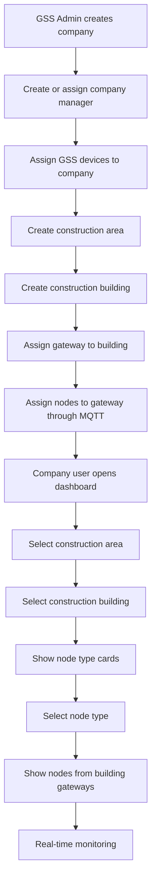

# GSS IoT Platform Redesign — AI-ready RBAC Requirements

> Purpose: Use this document as the main requirements source when redesigning the GSS IoT platform architecture, database, backend modules, admin/client UI modules, and RBAC model.

---

## 1. Project Context

GSS is an IoT company. GSS produces, sells, and/or rents IoT gateways and sensor nodes for construction companies.

Construction companies use the GSS platform to monitor safety conditions inside their construction areas and buildings. Gateways collect sensor data from connected nodes and send that data to the server. Company users then monitor node values in real time from the web dashboard.

The current/old project is already working, but it needs a full redesign because it was implemented when the original implementation experience was limited. Known problems in the old version:

- No proper RBAC system.
- Database structure has mistakes and needs redesign.
- Backend modules are mixed together.
- Some endpoints are placed in the wrong modules.
- Some code exists but is not used.
- Old architecture does not clearly separate GSS admin responsibilities from company/client responsibilities.
- Old hierarchy was too simple and must be extended.

The goal is to redesign the system while preserving the real business flow.

---

## 2. Architecture Baseline

Use the Parfumbox RBAC architecture as the baseline pattern.

Core RBAC concepts:

- Role
- Permission
- RolePermission
- Direct user permission
- Super admin bypass through `role.isSuperAdmin`
- Backend authentication guard
- Backend permission guard
- `@RequirePermissions(...)` decorator
- Frontend route guard
- Frontend sidebar guard
- Frontend action/button-level permission guard

Important rule:

> Backend permission checks are the real security layer. Frontend permission checks are only for UX.

---

## 3. Old vs New Business Hierarchy

### 3.1 Old hierarchy

```txt
Company
  -> Construction Building
      -> Node Type Cards
          -> Nodes
              -> Monitoring
```

### 3.2 New required hierarchy

```txt
Company
  -> Construction Area
      -> Construction Building
          -> Gateway(s)
              -> Node(s)
                  -> Node Type
                      -> Real-time Monitoring
```

A company can have multiple construction areas.

A construction area can have multiple construction buildings.

A building can have assigned gateways.

A gateway can have connected nodes.

Monitoring should be shown by building and node type.

---

## 4. Main Hardware Entities

### 4.1 Gateway

A gateway is a physical IoT device that:

- Connects to the GSS server.
- Collects data from connected sensor nodes.
- Sends sensor data to the server.
- Receives MQTT commands from the server.
- Receives node assignment commands.
- Receives alarm level update commands.
- Reports online/offline status.
- Belongs to GSS inventory first.
- Can be assigned to a company.
- Can be assigned to a construction building.

### 4.2 Node

A node is a physical sensor device that:

- Connects to a gateway.
- Sends sensor values through the gateway.
- Has a node type.
- Appears in monitoring pages according to company, construction area, building, gateway, and node type.

The old overview mentions 3 node types. The exact 3 node type names and their sensor values must be extracted from the old project source code and database.

---

## 5. Main Product Flow

### 5.1 GSS setup flow

1. GSS admin creates a construction company.
2. GSS admin creates or assigns a company manager/user.
3. GSS admin assigns GSS-owned gateways/nodes to the company.
4. Company or GSS admin creates construction areas.
5. Company or GSS admin creates construction buildings inside construction areas.
6. GSS admin assigns company gateways to the correct building.
7. GSS admin connects/assigns nodes to the correct gateway using MQTT commands.
8. Company user opens the dashboard.
9. User chooses a construction area.
10. User chooses a construction building.
11. The UI shows 3 node type cards.
12. User selects a node type.
13. The system shows all nodes of that type connected to gateways assigned to the selected building.
14. The user monitors node sensor values in real time.

### 5.2 Flow chart



---

## 6. Main Actors

## 6.1 GSS Platform Owner / GSS Admin

GSS-side internal users manage the whole platform.

Responsibilities:

- Manage companies.
- Manage construction areas/buildings where needed.
- Manage company managers/users where needed.
- Manage GSS internal admin users.
- Manage GSS roles and permissions.
- Manage global permission catalog.
- Manage GSS-owned devices.
- Assign gateways/nodes to companies.
- Assign gateways to buildings.
- Connect/assign nodes to gateways through MQTT.
- Monitor gateway/node operational status.
- View alarms and alarm history.
- Download reports.
- Audit critical changes.

In the old project, GSS admin effectively has access to everything because there is no permission system. In the new project, this must be replaced with RBAC.

## 6.2 Company Platform Manager

This is the highest-level user inside one construction company.

Responsibilities:

- Manage company dashboard.
- View/update company information if allowed.
- Manage construction areas.
- Manage construction buildings.
- Manage company users.
- Create custom company roles.
- Assign permissions to company roles.
- Assign users to construction areas/buildings.
- View monitoring for the company.
- Configure alarm rules/settings if allowed.
- View/download reports if allowed.

## 6.3 Construction Area Manager / Site Manager

This user manages one or more construction areas.

Responsibilities:

- View assigned construction areas.
- Manage assigned construction areas if allowed.
- Manage buildings inside assigned areas if allowed.
- View monitoring for buildings inside assigned areas.
- Manage building users if allowed.
- View alarms/reports for assigned scope if allowed.

Suggested role key: `area_manager` or `site_manager`.

## 6.4 Building Manager / Building Operator

This user manages or monitors one or more assigned buildings.

Responsibilities:

- View assigned building(s).
- View node type cards for assigned building(s).
- View real-time monitoring.
- Update alarm levels if allowed.
- Receive alarm notifications if configured.
- Cannot access other buildings unless explicitly assigned.

Suggested role key: `building_manager` or `building_operator`.

## 6.5 Viewer

A read-only company role.

Responsibilities:

- View assigned construction areas/buildings.
- View monitoring if allowed.
- Cannot create/update/delete users, roles, devices, alarm levels, or settings.

---

## 7. Company-side Functional Requirements

A company dashboard should support these functions:

1. View/update company profile information.
2. Create, view, update, and delete construction areas.
3. Create, view, update, and delete construction buildings.
4. Upload and delete building plan/map images.
5. View assigned gateways.
6. View assigned nodes.
7. View gateway-node connections.
8. View real-time monitoring by building and node type.
9. Update alarm levels for gateways/buildings if allowed.
10. Configure alarm notification rules if allowed.
11. View alarm history.
12. Acknowledge/resolve alarms if required.
13. View/download reports.
14. Manage company users.
15. Manage company roles.
16. Assign permissions to company roles.
17. Assign users to construction areas/buildings.

---

## 8. Device Assignment Requirements

Recommended conceptual rules:

- Devices are created in GSS inventory first.
- GSS can assign devices to a company.
- A gateway can be assigned to only one active building at a time.
- A node can be connected to only one active gateway at a time.
- Device assignment history should be auditable.
- Gateway-to-building assignment history should be auditable.
- Node-to-gateway assignment history should be auditable.
- MQTT command history should be saved.
- Offline gateway commands should be handled through a pending command/outbox mechanism.

Recommended command status values:

```txt
pending
sent
acknowledged
failed
expired
cancelled
```

---

## 9. Monitoring Requirements

When a user opens monitoring for a building:

1. User must be authenticated.
2. User must belong to the requested company.
3. User must have scope access to the requested construction area/building.
4. User must have monitoring permission.
5. UI shows 3 node type cards.
6. Selecting a node type shows nodes of that type.
7. Nodes must be filtered by gateways assigned to the selected building.
8. Sensor values should update in real time.
9. Backend must not trust frontend filters. Backend must enforce company/building scope.

Permission example:

```txt
monitoring.view
monitoring.realtime
```

Scope example:

```txt
User has monitoring.view + access to Building A
=> User can view Building A monitoring.

User has monitoring.view but no access to Building B
=> Backend returns 403 for Building B.
```

---

## 10. Alarm Level Requirements

Alarm levels can be configured from the monitoring page or a dedicated settings page.

When alarm level is updated:

1. Backend validates permission.
2. Backend validates company/building scope.
3. Backend saves the alarm level configuration.
4. Backend sends MQTT command to all gateways assigned to the building.
5. Online gateways update immediately.
6. Offline gateways should receive pending command when they reconnect, if pending-command logic is implemented.
7. Command status should be tracked.

Permission examples:

```txt
alarm-levels.view
alarm-levels.manage
```

---

## 11. Alarm Notification Requirements

The new project must add alarm notifications.

Alarm notification logic:

1. Node sends sensor value.
2. Backend receives sensor data from gateway.
3. Backend compares sensor value with alarm level/threshold.
4. If sensor value is safe, nothing is sent.
5. If sensor value becomes unsafe, backend starts a waiting period.
6. Waiting period is based on configured alarm sending time.
7. If the node value returns to safe state before waiting period ends:
   - No alarm notification is sent.
   - No final alarm event is saved to the database.
8. If the unsafe state continues until waiting period ends:
   - Alarm event is saved.
   - Notification is sent to configured recipients.
   - Delivery result is saved.

Possible models:

- `AlarmRule`
- `AlarmLevel`
- `AlarmCandidate` or in-memory/delayed job state
- `AlarmEvent`
- `AlarmRecipient`
- `AlarmNotification`
- `AlarmDeliveryLog`

Open questions:

- Is alarm sending time configured per role, per user, per company, per area, per building, gateway, node type, or alarm rule?
- Which channels are used: Telegram, SMS, email, web push, in-app notification, or all?
- Should cancelled unsafe states be saved for audit or not saved at all?
- Should alarms have states like `open`, `acknowledged`, `resolved`, `ignored`?
- Who is allowed to acknowledge or resolve alarms?

Permission examples:

```txt
alarms.view
alarms.manage
alarms.acknowledge
alarm-rules.view
alarm-rules.manage
notifications.view
notifications.manage
```

---

## 12. Reporting Requirements

Reports are a new required feature.

Possible report categories:

- Company report.
- Construction area report.
- Construction building report.
- Device inventory report.
- Device assignment report.
- Gateway status report.
- Node status report.
- Sensor history report.
- Alarm history report.
- MQTT command history report.
- User activity report.
- Audit log report.

Viewing reports and exporting/downloading reports must be separate permissions.

Permission examples:

```txt
reports.view
reports.export
reports.company
reports.devices
reports.monitoring
reports.alarms
reports.audit
```

Exact report types must be finalized after reviewing the old project code, old database, and real business needs.

---

## 13. RBAC Scope Design

This project needs two RBAC scopes, not one flat RBAC model.

## 13.1 GSS Admin RBAC

Used by GSS internal users.

Recommended models:

- `GssAdminUser`
- `GssRole`
- `Permission`
- `GssRolePermission`
- `GssAdminUserPermission`

Behavior:

- GSS super admin has `isSuperAdmin = true`.
- Super admin bypasses all permission checks.
- Non-super admins use role permissions + direct user permissions.
- GSS permissions control GSS Admin Portal pages and `/admin/*` API endpoints.

## 13.2 Company/User RBAC

Used by construction company users.

Recommended models:

- `CompanyUser`
- `CompanyRole`
- `Permission`
- `CompanyRolePermission`
- `CompanyUserPermission`
- `CompanyUserScope`
- `CompanyUserAreaAccess`
- `CompanyUserBuildingAccess`

Behavior:

- Company user permissions control company dashboard pages and company API endpoints.
- Company Platform Manager can create custom company roles.
- Company user access must check both permission and scope.
- Building-level users must not access other buildings.

Example:

```txt
Permission check:
  Does user have monitoring.view?

Scope check:
  Does user belong to this company?
  Does user have access to this construction area or building?

Only if both checks pass, request is allowed.
```

---

## 14. Recommended Default Roles

## 14.1 GSS-side roles

### `gss_super_admin`

Full platform access.

Rules:

- `isSuperAdmin = true`.
- Cannot be restricted through normal UI/API.
- Cannot delete/deactivate last active super admin.
- Can manage roles, permissions, users, companies, devices, reports, alarms, settings.

### `gss_admin`

Operational admin.

Can manage:

- Companies.
- Company managers.
- Construction areas/buildings if needed.
- Device assignment.
- Monitoring overview.
- Alarms.
- Reports.

Should not necessarily manage:

- GSS super admin role.
- System-critical permissions.
- Dangerous global settings.

### `gss_device_manager`

Device operations role.

Can manage:

- Gateways.
- Nodes.
- Device assignments.
- Node-to-gateway connections.
- MQTT commands.
- Device status.

### `gss_support`

Support/read-only or limited update role.

Can:

- View companies.
- View devices.
- View monitoring state.
- View alarms.
- View logs if allowed.

Cannot:

- Change critical settings.
- Manage roles/permissions.
- Delete data.

### `gss_report_manager`

Reporting role.

Can:

- View reports.
- Export reports.
- View report-related history.

## 14.2 Company-side roles

### `platform_manager`

Full access inside one company.

Can manage:

- Company profile.
- Areas.
- Buildings.
- Building plans/maps.
- Company users.
- Company roles.
- Role permissions.
- User area/building assignments.
- Monitoring.
- Alarm levels.
- Alarm rules.
- Reports.

### `area_manager` / `site_manager`

Manages assigned construction areas.

Can:

- View assigned areas.
- View/manage buildings inside assigned areas if allowed.
- View monitoring for assigned areas.
- View/manage alarms for assigned areas if allowed.
- View reports for assigned scope if allowed.

### `building_manager` / `building_operator`

Manages or monitors assigned buildings.

Can:

- View assigned building.
- View monitoring.
- Update alarm levels if allowed.
- Receive alarms.
- View alarms for assigned building.

### `viewer`

Read-only role.

Can:

- View assigned areas/buildings.
- View monitoring if allowed.

Cannot:

- Create/update/delete users, roles, buildings, devices, settings, or alarm levels.

---

## 15. Initial Permission Naming Convention

Use dot-based keys.

Format:

```txt
module.action
```

Recommended common actions:

```txt
view
create
update
delete
manage
assign
export
configure
acknowledge
resolve
```

Initial permission examples:

```txt
dashboard.view

companies.view
companies.manage

areas.view
areas.manage

buildings.view
buildings.manage

building-plans.view
building-plans.manage

devices.view
devices.manage
devices.assign

gateways.view
gateways.manage
gateways.assign

nodes.view
nodes.manage
nodes.assign

monitoring.view
monitoring.realtime

alarm-levels.view
alarm-levels.manage

alarms.view
alarms.manage
alarms.acknowledge
alarms.resolve

alarm-rules.view
alarm-rules.manage

notifications.view
notifications.manage

reports.view
reports.export

company-users.view
company-users.manage

company-roles.view
company-roles.manage
company-permissions.view

settings.admin-users.view
settings.admin-users.manage
settings.roles.view
settings.roles.manage
settings.permissions.view
settings.permissions.manage

audit-logs.view
audit-logs.export
```

The final permission list must be created after reviewing the old source code and existing endpoints.

---

## 16. UI Modules and Pages

## 16.1 GSS Admin Portal

Recommended pages:

```txt
/welcome
/dashboard
/companies
/companies/:companyId
/companies/:companyId/areas
/companies/:companyId/buildings
/companies/:companyId/users
/devices
/gateways
/nodes
/device-assignments
/mqtt-commands
/monitoring
/alarms
/alarm-rules
/reports
/audit-logs
/settings/admin-users
/settings/roles
/settings/permissions
/settings/system
```

Every page must have a route-level permission.

Every sidebar item must have a permission.

Every create/update/delete/export button must have action-level permission.

## 16.2 Company Dashboard

Recommended pages:

```txt
/welcome
/dashboard
/areas
/areas/:areaId
/buildings
/buildings/:buildingId
/buildings/:buildingId/plan
/buildings/:buildingId/monitoring
/buildings/:buildingId/monitoring/:nodeType
/buildings/:buildingId/alarm-levels
/alarms
/reports
/users
/roles
/settings
```

Company dashboard must apply both permission and scope.

Example:

```txt
/buildings/:buildingId/monitoring
requires:
  monitoring.view
  + company membership
  + building access
```

---

## 17. Backend Modules

Recommended backend modules:

```txt
AuthModule
GssAdminAuthModule
CompanyAuthModule

RbacModule
GssAdminRbacModule
CompanyRbacModule

CompaniesModule
ConstructionAreasModule
ConstructionBuildingsModule
BuildingPlansModule

CompanyUsersModule
GssAdminUsersModule

DevicesModule
GatewaysModule
NodesModule
DeviceAssignmentsModule

MqttModule
GatewayCommandsModule

MonitoringModule
SensorReadingsModule

AlarmLevelsModule
AlarmRulesModule
AlarmsModule
NotificationsModule

ReportsModule
AuditLogsModule
SettingsModule
```

Every protected endpoint should use:

```ts
@UseGuards(AuthGuard, PermissionsGuard, ScopeGuard)
@RequirePermissions('module.action')
```

For GSS admin endpoints:

```ts
@AdminEndpoint()
@RequirePermissions('companies.view')
```

For company endpoints:

```ts
@CompanyEndpoint()
@RequirePermissions('monitoring.view')
@RequireCompanyScope()
@RequireBuildingScope()
```

---

## 18. Conceptual Database Areas

The final DB diagram must be built after reviewing the old project. Initial conceptual areas:

### 18.1 Organization

- Company
- ConstructionArea
- ConstructionBuilding
- BuildingPlanImage

### 18.2 Users and RBAC

- GssAdminUser
- GssRole
- CompanyUser
- CompanyRole
- Permission
- GssRolePermission
- GssAdminUserPermission
- CompanyRolePermission
- CompanyUserPermission
- CompanyUserAreaAccess
- CompanyUserBuildingAccess

### 18.3 Devices

- Device
- Gateway
- Node
- NodeType
- CompanyDeviceAssignment
- GatewayBuildingAssignment
- NodeGatewayAssignment
- GatewayCommand
- MqttMessageLog

### 18.4 Monitoring

- SensorReading
- LatestNodeState
- GatewayStatusHistory
- NodeStatusHistory

### 18.5 Alarm/Notification

- AlarmLevel
- AlarmRule
- AlarmEvent
- AlarmNotification
- AlarmDeliveryLog
- AlarmRecipientRule

### 18.6 Reporting and Audit

- ReportJob
- ReportExport
- AuditLog

---

## 19. Expected AI Output After Old Project ZIP Is Uploaded

After the old working project zip is uploaded, the AI should:

1. Review old documentation.
2. Review backend code.
3. Review frontend/admin/client code.
4. Review existing database schema.
5. Find unused code.
6. Find misplaced endpoints.
7. Find module responsibility problems.
8. Extract current functional modules.
9. Extract current API endpoints.
10. Extract current UI pages.
11. Propose clean new module architecture.
12. Propose GSS Admin RBAC.
13. Propose Company/User RBAC.
14. Propose default roles.
15. Propose complete permission list.
16. Create role-permission matrix.
17. Create UI page-permission matrix.
18. Create backend endpoint-permission matrix.
19. Create new database diagram.
20. Design alarm notification flow.
21. Design reporting flow.
22. Explain no-permission role behavior.
23. Explain super admin behavior.
24. Explain inactive user behavior.
25. Explain self-lockout prevention.
26. Explain offline gateway command behavior.

---

## 20. Required Edge Cases

### 20.1 No-permission role

If a non-super role has no permissions:

- Login can still work if the user is active.
- Profile endpoint should still work.
- Sidebar should show only default allowed pages, such as Welcome.
- Protected pages should redirect to Forbidden.
- Protected backend endpoints should return 403.
- Notification widgets must not call protected endpoints unless permission exists.

### 20.2 Super admin

Super admin should have full access through `isSuperAdmin = true`.

Even if explicit permission rows are missing, super admin should still pass permission checks.

Super admin role permissions should not be removable from normal UI/API.

### 20.3 Inactive user

If user is inactive:

- Login should fail.
- Existing tokens should no longer work.
- Backend should return 401.
- Frontend should logout the user.

### 20.4 Scope-based access

Company users need both permission and scope access.

Examples:

```txt
monitoring.view + Building A access => allowed for Building A
monitoring.view + no Building B access => forbidden for Building B
```

### 20.5 Self-lockout prevention

The system must prevent:

- Deleting the last active GSS super admin.
- Deactivating the last active GSS super admin.
- Removing super admin role from the last active GSS super admin.
- Removing all role/user management permissions if no other safe admin remains.
- Company platform manager accidentally removing their own role-management access if they are the only manager.

### 20.6 Offline gateway command handling

When gateway is offline:

- Alarm level update commands should be saved as pending or marked failed according to final design.
- Node assignment commands should be auditable.
- Pending commands should be sent when gateway reconnects if outbox logic is implemented.
- Command status should be visible to admins.

---

## 21. Open Questions To Answer From Old Project

1. What are the exact 3 node types?
2. What sensor values does each node type send?
3. How are gateways authenticated?
4. How are nodes identified?
5. How are MQTT topics currently named?
6. How are MQTT command payloads structured?
7. Can one gateway move between buildings over time?
8. Can one node move between gateways over time?
9. Is device rental/sale history required?
10. Is company device contract history required?
11. Which alarm notification channels are required?
12. Is alarm sending time configured per role, user, company, area, building, gateway, node type, or alarm rule?
13. Should cancelled unsafe states be stored or ignored?
14. Which reports are required by the business?
15. Should company platform managers create new permissions, or only assign fixed permissions to roles?
16. Should GSS admins impersonate company users for support?
17. Should every critical change be audit-logged?
18. Should deleted entities be hard-deleted or soft-deleted?

---

## 22. Files To Keep In The ChatGPT Project

Recommended project sources:

```txt
parfumbox-rbac-reference.md
new_project_rbac_prompt.md
gss-iot-rbac-requirements-ai-ready.md
old-project.zip
```

Recommended files inside the actual source repository:

```txt
docs/project-overview.md
docs/rbac-requirements.md
docs/architecture-notes.md
docs/api-permission-matrix.md
docs/ui-permission-matrix.md
docs/db-redesign-notes.md
```

---

## 23. Recommended Prompt For Future Chats

Use this inside the ChatGPT Project:

```txt
Use the uploaded Parfumbox RBAC reference and GSS IoT RBAC requirements as the baseline.

Analyze the uploaded old project zip completely: backend, frontend, docs, database schema, endpoints, unused code, and mixed modules.

Then design the new GSS IoT platform architecture with:

1. Full flow chart
2. Module list
3. Permission naming convention
4. Default roles
5. Role-permission matrix
6. DB schema / DB diagram
7. Backend guard/decorator architecture
8. Endpoint-permission matrix
9. Admin UI page-permission matrix
10. Company UI page-permission matrix
11. Sidebar/action button permission rules
12. Seed data
13. Alarm notification design
14. Report design
15. Edge cases: no permission role, super admin, inactive user, self-lockout, offline gateway commands

Explain in Uzbek with practical file/folder-level details.
```
